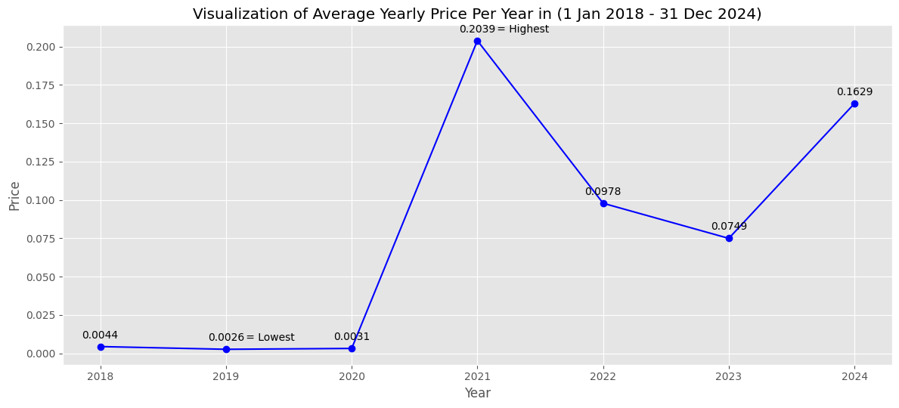

# Prediction and Analysis of Dogecoin Price Movements with Gated Recurrent Unit (GRU)

## Introduction

&nbsp;&nbsp;&nbsp;&nbsp;&nbsp; In this project, I have built a simple analysis tool as well as a prediction model for the price of Dogecoin using Gated Recurrent Units (GRU). GRU is a derivative of the Recurrent Neural Network (RNN) model which has undergone improvements, namely by having a simpler structure which only has an Update Gate and a Reset Gate. The following is an overview of the GRU architecture:

 
  
   
 <b>GRU Architecture</b>

&nbsp;&nbsp;&nbsp;&nbsp;&nbsp; Dataset used in my project this is the daily of Dogecoin from December 25 2017 to December 31 2024 (7 Years 1 Week) which is recorded every day. I obtained the dataset from Investing.com, you can check the dataset at this link: https://www.investing.com/crypto/dogecoin/historical-data. Here is a information Dogecoin daily historical dataset I used on this project:

 
  
   
 <b>Information of Dogecoin Dataset</b>

&nbsp;&nbsp;&nbsp;&nbsp;&nbsp; The following are the hyperparameters and their values ​​used in the process of building and training this prediction model:

| **Hyperparameter**    | **Value**             |
|:---------------------:|:---------------------:|
| Units                | 128                   |
| Activation function  | tanh                  |
| Dropout rate        | 0.4                   |
| Optimizer           | Adam                  |
| Learning rate       | 0.001                 |
| Loss function       | Mean Squared Error (MSE) |
| Epochs              | 200                   |
| Batch size          | 128                   |
| Early stopping      | Patience (10)         |

## Results

&nbsp;&nbsp;&nbsp;&nbsp;&nbsp; Prediction model results interpreted with several plot visualizations and evaluated with evaluation metrics among others namely MAE, MSE, RMSE and MAPE, to determine performance and level of accuracy is obtained by the prediction model is in predicting the price of Dogecoin, as well as presenting several visualizations of knowledge obtained from the daily historical dataset of Dogecoin. The following is a summary of interpretation and evaluation as a reference to determine the performance and level of accuracy obtained by the prediction model to predict the price of Dogecoin as well as several visualization results for analysis purposes:

### - Plot Training and Validation Loss Over Epochs

 
&nbsp;&nbsp;&nbsp;&nbsp;&nbsp; Plot Training and Validation Loss Over Epochs the aim here is to monitor whether the model is experiencing overfitting or underfitting not during model training.

 
  
   
 <b>Visualization of Plot Training and Validation Loss Over Epochs</b>

### - Plot and Comparison Table of Actual Prices vs Predicted Prices

 
&nbsp;&nbsp;&nbsp;&nbsp;&nbsp; Plot and Comparison Table of Actual Prices vs Predicted Prices here the aim is to compare actual prices with the predicted prices generated by the model, so it can see as far as possible where the model can capture existing patterns in historical data and make predictions future prices with good accuracy.

 
  
   
 <b>Visualization of Comparison Plot Actual Prices vs Predicted Prices</b>

 
  
   
 <b>Comparison Table of Actual Prices vs Predicted Prices</b>

 
  
   
 <b>Comparison Difference</b>

### - Evaluation Metrics

 
  
   
 <b>Evaluation Metrics</b>

 
&nbsp;&nbsp;&nbsp;&nbsp;&nbsp; Based on the results of the evaluation metrics above, it shows that the prediction model using the GRU algorithm has value the average error is relatively very small. This can be seen from the Mean value Absolute Error (MAE) is 0.00711, Mean Squared Error (MSE) is 0.00018, Root Mean Squared Error (RMSE) is 0.01330, and Mean Absolute Percentage Error (MAPE) is 4.37% (Accuracy: 95.63%), this indicates that the model is able to predict high level of accuracy.

### - Moving Average Price

 
&nbsp;&nbsp;&nbsp;&nbsp;&nbsp; Moving Average Price aims to provide an overview clearer about short-term and long-term trends in movement Dogecoin price. Moving Average Price too help stakeholders to see more stable price patterns and reduced noise from possible daily volatility confusing.

- Yearly

 
  
   
 <b>Visualization of Average Yearly Price Per Year in (1 Jan 2018 - 31 Dec 2024)</b>

- Monthly

 
  
   
 <b>Visualization of Average Monthly Price in (1 Jan 2018 - 31 Dec 2024)</b>

- Weekly

 
  
   
 <b>Visualization of Average Weekly Price in (1 Jan 2018 - 31 Dec 2024)</b>

- Daily

 
  
   
 <b>Visualization of Average Daily Price Per Day in (1 Jan 2018 - 31 Dec 2024)</b>

 
&nbsp;&nbsp;&nbsp;&nbsp;&nbsp; Based on analysis of graphic visualization of average price movements monthly, weekly and daily Dogecoin prices can be concluded that stakeholders can buy Dogecoin at the lowest price in January, precisely in the fourth week on the 22nd, and sell it at the highest price in May, precisely in the fifth week on the 29th.

---------------------------------------------------------------------------------------------------------------------------------------------------------------------------------

For details you can check my code : [Source Code.ipynb](https://github.com/willy377/Prediction_and_Analysis_of_Dogecoin_Price_Movements_with_Gated-Recurrent_Unit--GRU-/blob/main/Source%20Code.ipynb)

